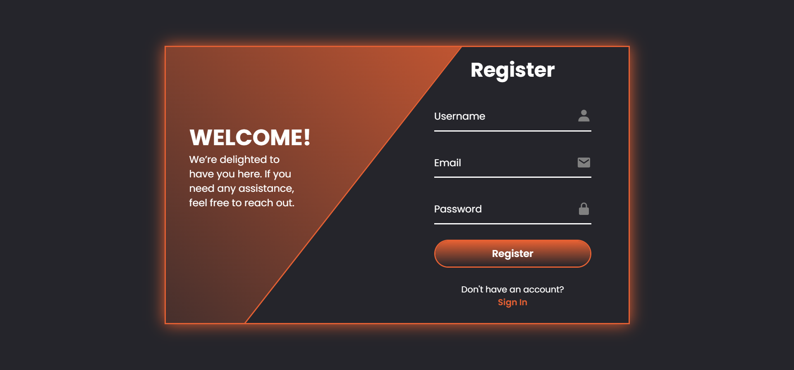
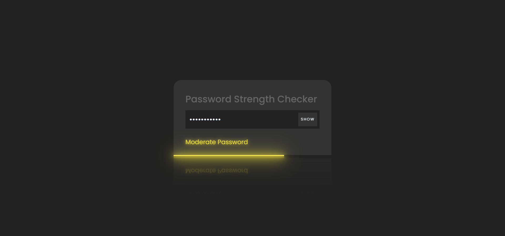

# 📚 Git Project School – Web Experiments Collection

This repository contains **three frontend mini-projects** built using **HTML, CSS, and JavaScript**.
All projects are fully responsive and suitable for academic submission, web fundamentals practice, or portfolio use.

---

# 1️⃣ Animated Login & Register Form

A modern, animated authentication UI built with smooth transitions between Login and Signup forms.

### 📸 Demo

### ⭐ Features

* Animated sliding form transitions
* Curved background shapes
* Login and Signup forms
* Responsive UI
* Boxicons integrated

### 📂 Files

* `index.html`
* `style.css`
* `index.js`

---

# 2️⃣ Password Strength Checker

A simple interactive tool that checks password strength using JavaScript.

### 📸 Demo

### ⭐ Features

* Live password strength meter
* Shows strength level (weak, medium, strong)
* Show/Hide password toggle
* Fully responsive

### 📂 Files

* `index.html`
* `style.css`
* `script.js`

---

# 3️⃣ vCard – Personal Portfolio

A fully responsive personal portfolio template for showcasing your skills, projects, and contact information.

### 📸 Demo

### ⭐ Features

* Modern and clean UI
* Mobile-friendly layout
* Sections for About, Skills, Portfolio, and Contact
* Lightweight (pure HTML, CSS, JavaScript)

---

# 📜 License

All projects in this repository are **free to use** and contain **no license restrictions**.

---

# 🙌 Credits

Created for **School Git Project** as part of frontend web development practice.

Feel free to modify, improve, and build upon these projects!
